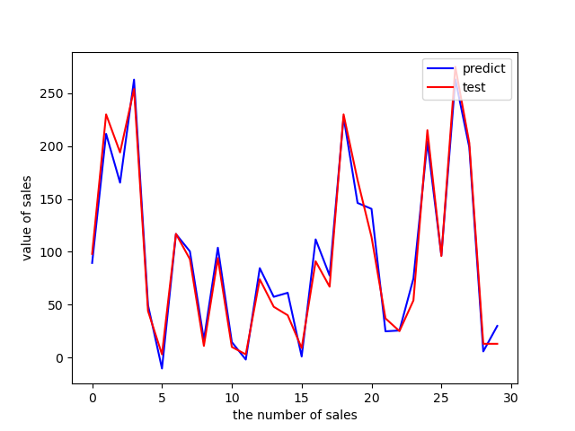

# 基于线性回归的PM2.5的预测模型

## 作品介绍

### 背景

随着经济社会发展，空气污染情况成为我们不得不关注的问题，其中Pm2.5为重要的空气质量评价指标，本项目使用`sklearn`进行线性回归建模，并进行预测。

### 截图

经过绘图发现，PM2.5和空气中$SO_2$、$NO_2$、$CO$, 以及气压、露点温度近似成线性关系，使用sklearn中的线性回归模型进行训练拟合并预测

取数据中的$20\%$作为测试数据验证模型的可靠性，如上图所示。

**数据来源**：

[UCI Machine Learning Repository](https://archive.ics.uci.edu/ml/datasets.php?format=mat&task=&att=&area=phys&numAtt=10to100&numIns=&type=ts&sort=attUp&view=list)

## 团队：今天睡醒了吗

**成员**：iLern

**联系方式**：

> email: Taisitong@outlook.com
>
> qq: 416138794

## 使用到的AWS技术

`Amazon SageMaker`

